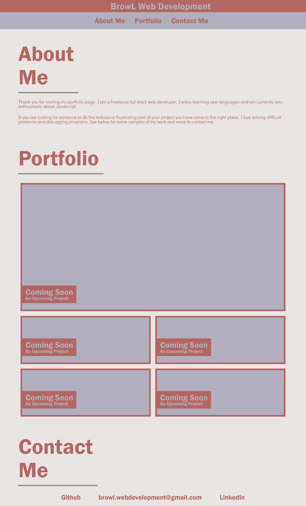

# updated-portfolio-2021

A new portfolio for a new year.

## Purpose and Scope

This portfolio is meant to be a online homepage for me as a web developer. It includes information about me and my path towards web development as a career, links to projects that I have worked on and any apps that I have developed, and a contact page for getting in touch with me.

The portfolio was designed with mobile usage in mind and is meant to be responsive to the size of the viewing screen.

## Description

A web page with my web developer name, an image of me, my portfolio, and the best ways to contact me.

## Installation

No installation required. You can access this page at:
https://lasettebrown.github.io/updated-portfolio-2021/

## Built with

HTML
CSS

## Authors

Authored by Lasette Brown.

© 2021 Lasette Brown. All Rights Reserved.
